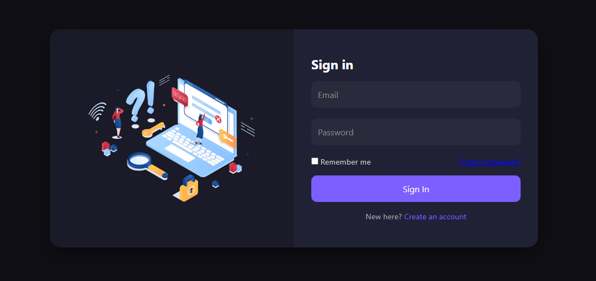

# React Login Portal

A **responsive, dark-themed authentication portal** built with **React + TypeScript**.  
This frontend-only login interface is designed for quick prototyping and demonstration of authentication workflows.  

---

## Features

- **Responsive design** – works on desktop, tablet, and mobile  
- **Real-time form validation** – alerts users if fields are missing  
- **Local user storage** – demo credentials saved in `localStorage`  
- **Modern UI** – dark theme with clean, professional layout  
- **Ready for protected routes** – easily extendable for routing and authentication  

---

## Demo Screenshot

  

---

## Getting Started

Follow these instructions to run the project locally.

### 1. Clone the repository

git clone https://github.com/blessador/react-login-portal.git
cd react-login-portal

---

### **2. Install dependencies**

npm install
---

### **3. Run the development server**

npm start
Open http://localhost:3000
 in your browser to view the app.
The page will reload automatically if you make edits.

---

### **Build for Production**

To create an optimized production build:

npm run build

This will generate a build/ folder with all static files, ready to deploy.

